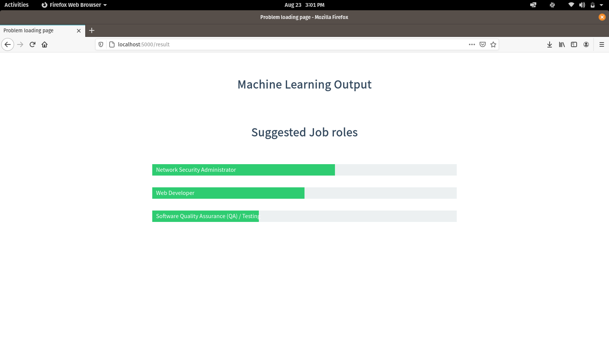

# Career Guidance using Machine Learning
It is a project written in python using flask to get inputs from students and predict the career path they can take using machine learning

## Live Demo
The application is hosted in https://careerguidance.herokuapp.com

## Screenshots
### Home page

### Result page


## Running locally
### Installing requirements
```
pip install -r requirements.txt
```
### Running the application
```
python main2.py
```
## Running using Docker
Make sure you have installed docker and docker-compose

```
sudo docker-compose up
```
#### Tested in linux
The instruction for running in windows may vary 
