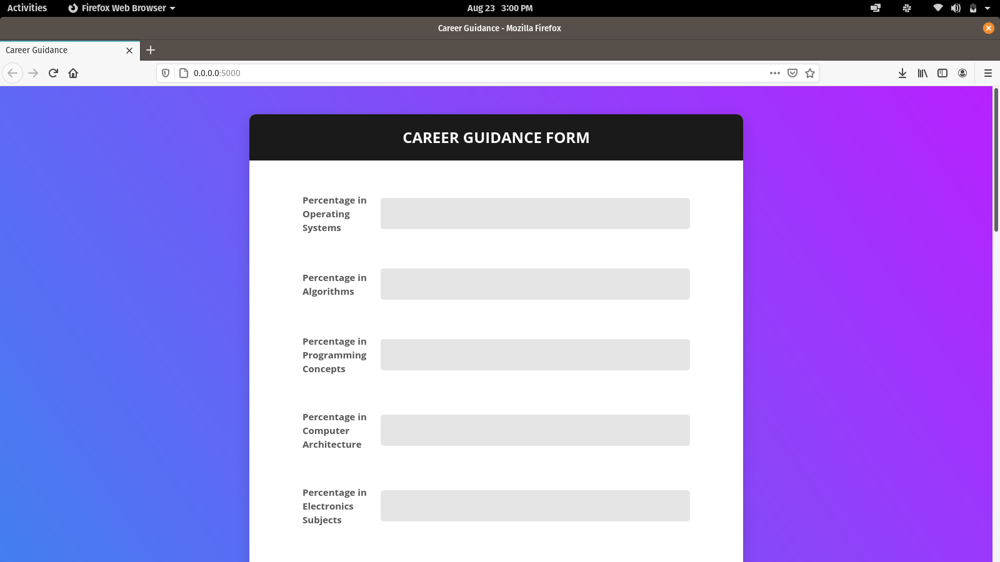

# Career Guidance using Machine Learning
It is a project written in python using flask to get inputs from students and predict the career path they can take using machine learning

## Screenshots
### Home page

### Result page

